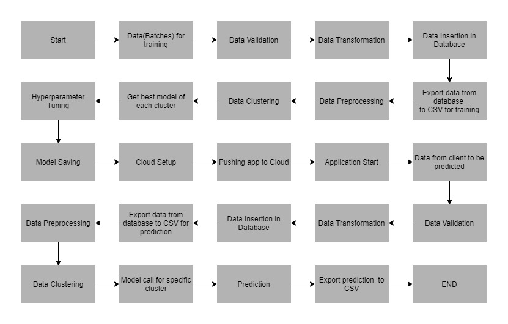

# Wafer Sensor

## Problem Statement

- The inputs of various sensors for different wafers have been provided. In electronics, a wafer (also called a slice or substrate) is a thin slice of semiconductor used for the fabrication of integrated circuits.

- The goal is to build a machine learning model which predicts whether a wafer needs to be replaced or not(i.e., whether it is working or not) based on the inputs from various sensors. There are two classes: +1 and -1.

## Data Description

The client will send data in multiple sets of files in batches at a given location. Data will contain Wafer names and 590 columns of different sensor values for each wafer. The last column will have the "Good/Bad" value for each wafer.

"Good/Bad" column will have two unique values +1 and -1.

- "+1" represents Bad wafer.
- "-1" represents Good Wafer.

Apart from training files, we also require a "schema" file from the client, which contains all the relevant information about the training files such as: Name of the files, Length of Date value in FileName, Length of Time value in FileName, Number of Columns, Name of the Columns, and their datatype.

## Data Validation

In this step, we perform different sets of validation on the given set of training files.

Name Validation - We validate the name of the files based on the given name in the schema file. We have created a regex pattern as per the name given in the schema file to use for validation. After validating the pattern in the name, we check for the length of date in the file name as well as the length of time in the file name. If all the values are as per requirement, we move such files to "Good_Data_Folder" else we move such files to "Bad_Data_Folder."

Number of Columns - We validate the number of columns present in the files, and if it doesn't match with the value given in the schema file, then the file is moved to "Bad_Data_Folder."

Name of Columns - The name of the columns is validated and should be the same as given in the schema file. If not, then the file is moved to "Bad_Data_Folder".

The datatype of columns - The datatype of columns is given in the schema file. This is validated when we insert the files into Database. If the datatype is wrong, then the file is moved to "Bad_Data_Folder".

Null values in columns - If any of the columns in a file have all the values as NULL or missing, we discard such a file and move it to "Bad_Data_Folder".

## Data Insertion in Database

1. Database Creation and connection - Create a database with the given name passed. If the database is already created, open the connection to the database.
2. Table creation in the database - Table with name - "Good_Data", is created in the database for inserting the files in the "Good_Data_Folder" based on given column names and datatype in the schema file. If the table is already present, then the new table is not created and new files are inserted in the already present table as we want training to be done on new as well as old training files.
3. Insertion of files in the table - All the files in the "Good_Data_Folder" are inserted in the above-created table. If any file has invalid data type in any of the columns, the file is not loaded in the table and is moved to "Bad_Data_Folder".

## Model Training

1. Data Export from Db - The data in a stored database is exported as a CSV file to be used for model training.
2. Data Preprocessing

- Check for null values in the columns. If present, impute the null values using the KNN imputer.
- Check if any column has zero standard deviation, remove such columns as they don't give any information during model training.

3. Clustering - KMeans algorithm is used to create clusters in the preprocessed data. The optimum number of clusters is selected by plotting the elbow plot, and for the dynamic selection of the number of clusters, we are using "KneeLocator" function. The idea behind clustering is to implement different algorithms To train data in different clusters. The Kmeans model is trained over preprocessed data and the model is saved for further use in prediction.
4. Model Selection - After clusters are created, we find the best model for each cluster. We are using two algorithms, "Random Forest" and "XGBoost". For each cluster, both the algorithms are passed with the best parameters derived from GridSearch. We calculate the AUC scores for both models and select the model with the best score. Similarly, the model is selected for each cluster. All the models for every cluster are saved for use in prediction.

## Prediction Data Description

Client will send the data in multiple set of files in batches at a given location. Data will contain Wafer names and 590 columns of different sensor values for each wafer.

Apart from prediction files, we also require a "schema" file from client which contains all the relevant information about the training files such as:

Name of the files, Length of Date value in FileName, Length of Time value in FileName, Number of Columns, Name of the Columns and their datatype.

## Data Validation

In this step, we perform different sets of validation on the given set of training files.

1. Name Validation- We validate the name of the files on the basis of given Name in the schema file. We have created a regex pattern as per the name given in schema file, to use for validation. After validating the pattern in the name, we check for length of date in the file name as well as length of time in the file name. If all the values are as per requirement, we move such files to "Good_Data_Folder" else we move such files to "Bad_Data_Folder".
2. Number of Columns - We validate the number of columns present in the files, if it doesn't match with the value given in the schema file then the file is moved to "Bad_Data_Folder".
3. Name of Columns - The name of the columns is validated and should be same as given in the schema file. If not, then the file is moved to "Bad_Data_Folder".
4. Datatype of columns - The datatype of columns is given in the schema file. This is validated when we insert the files into Database. If dataype is wrong then the file is moved to "Bad_Data_Folder".
5. Null values in columns - If any of the columns in a file has all the values as NULL or missing, we discard such file and move it to "Bad_Data_Folder".

## Data Insertion in Database

1. Database Creation and connection - Create database with the given name passed. If the database is already created, open the connection to the database.
2. Table creation in the database - Table with name - "Good_Data", is created in the database for inserting the files in the "Good_Data_Folder" on the basis of given column names and datatype in the schema file. If table is already present then new table is not created, and new files are inserted the already present table as we want training to be done on new as well old training files.
3. Insertion of files in the table - All the files in the "Good_Data_Folder" are inserted in the above-created table. If any file has invalid data type in any of the columns, the file is not loaded in the table and is moved to "Bad_Data_Folder".

## Prediction

1. Data Export from Db - The data in the stored database is exported as a CSV file to be used for prediction.
2. Data Preprocessing

- Check for null values in the columns. If present, impute the null values using the KNN imputer.
- Check if any column has zero standard deviation, remove such columns as we did in training.

3. Clustering - KMeans model created during training is loaded, and clusters for the preprocessed prediction data is predicted.
4. Prediction - Based on the cluster number, the respective model is loaded and is used to predict the data for that cluster.

Once the prediction is made for all the clusters, the predictions along with the Wafer names are saved in a CSV file at a given location and the location is returned to the client.

##Deployment

## Workflow



## Project Organization

    ├── LICENSE
    ├── Makefile           <- Makefile with commands like `make data` or `make train`
    ├── README.md          <- The top-level README for developers using this project.
    ├── data
    │   ├── external       <- Data from third party sources.
    │   ├── interim        <- Intermediate data that has been transformed.
    │   ├── processed      <- The final, canonical data sets for modeling.
    │   └── raw            <- The original, immutable data dump.
    │
    ├── docs               <- A default Sphinx project; see sphinx-doc.org for details
    │
    ├── models             <- Trained and serialized models, model predictions, or model summaries
    │
    ├── notebooks          <- Jupyter notebooks. Naming convention is a number (for ordering),
    │                         the creator's initials, and a short `-` delimited description, e.g.
    │                         `1.0-jqp-initial-data-exploration`.
    │
    ├── references         <- Data dictionaries, manuals, and all other explanatory materials.
    │
    ├── reports            <- Generated analysis as HTML, PDF, LaTeX, etc.
    │   └── figures        <- Generated graphics and figures to be used in reporting
    │
    ├── requirements.txt   <- The requirements file for reproducing the analysis environment, e.g.
    │                         generated with `pip freeze > requirements.txt`
    │
    ├── setup.py           <- makes project pip installable (pip install -e .) so src can be imported
    ├── src                <- Source code for use in this project.
    │   ├── __init__.py    <- Makes src a Python module
    │   │
    │   ├── data           <- Scripts to download or generate data
    │   │   └── make_dataset.py
    │   │
    │   ├── features       <- Scripts to turn raw data into features for modeling
    │   │   └── build_features.py
    │   │
    │   ├── models         <- Scripts to train models and then use trained models to make
    │   │   │                 predictions
    │   │   ├── predict_model.py
    │   │   └── train_model.py
    │   │
    │   └── visualization  <- Scripts to create exploratory and results oriented visualizations
    │       └── visualize.py
    │
    └── tox.ini            <- tox file with settings for running tox; see tox.readthedocs.io

---

### STEP 1: Create and activate new environment

```
conda create -n sensor-detection python=3.10 -y
```

```
conda activate sensor-detection
```

```
source activate sensor-detection
```

### STEP 2 Create a default structure

- Install cookiecutter template

```
pip install cookiecutter
```

- Start a new project

```
cookiecutter https://github.com/drivendata/cookiecutter-data-science
```

After above step you'll be given options in the command line.

- project_name:
- repo_name:
- author_name:
- description:
- Select open_source_license:
- s3_bucket [Optional]:
- Select python_interpreter:

### STEP 3 Get the dataset

(Dataset)[https://github.com/iNeuron-Pvt-Ltd/wafer-dataset/archive/main.zip]

### STEP 4 Initialize git in Current working directory in your terminal, command prompt or git bash.

```
git init
```

### STEP 5 Install DVC and its gdrive extension

```
pip install dvc
```

```
pip install dvc[gdrive]
```

### STEP 6 Initialize DVC

```
dvc init
```

### STEP 7 Add data into dvc for tracking

```
dvc add Training_Batch_Files/*.csv Prediction_Batch_files/*.csv
```

```
import os
import glob

data_dirs = ["Training_Batch_Files", "Prediction_Batch_files"]

for data_dir in data_dirs:
    files = glob.glob(os.path.join("E:\\Wafer Sensor\\Wafer-Sensor", data_dir, "*.csv"))
    for file_path in files:
        os.system(f'dvc add "{file_path}"')

print("\n #### All files added to DVC ####")
```

### STEP 8 commit and push to the remote repository

```
git add . && git commit -m "first commit and added raw data"
```

```
git branch -M main
```

```
git remote add origin https://github.com/AcheampongStephen/Wafer-Sensor.git
```

```
git push -u origin main
```

### STEP 9 Create and checkout a development branch for our development

```
git checkout -b dev
```

### STEP 10 Add remote storage

```
dvc remote add -d storage gdrive://<**************>
```

```
git add .dvc/config && git commit -m "Configure remote storage"
```

### STEP 11 Push the data to the remote storage-

```
dvc push
```

This step will ask you to authenticate yourself by clicking on the link which will appear in the terminal. Once you allow dvc to read and write on gdrive it'll give an access token which you'll paste in the terminal.

Now the copy of your data will be pushed to the gdrive. Above step will create a gdrive credential file (Now check next step).

### STEP 12 Add Gdrive credential secrets in github repo secrets.

- Find this credentials in the given path -

```
.dvc >> temp >> gdrive-user-credentials.json
```

- Now to add the secrets in your github repo -

* Go to settings
* secrets
* Click on add secrets
* Give name of secretes
* Paste the json file content from gdrive-user-credentials.json

###### To retrieve data anytime

```
dvc pull1
```

### STEP 13 Install full requirements.txt as given in the repository

```
pip install -r requirements.txt
```

###### One line readme update and push command to dev branch-

```
git add README.md && git commit -m "update readme" && git push origin dev
```

#### STEP 14 Create data preparation pipeline

```
touch src/pipeline_01_data_preparation.py
```

#### STEP 14 Create config directory / params.yaml (config/params.yaml)

```
mkdir config
```

```
touch config/params.yaml
```
