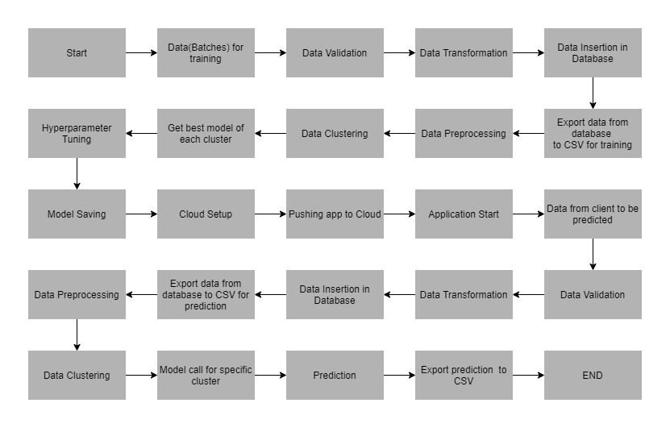

# WAFER

### PROBLEM STATEMENT
 <p>The inputs of various sensors for different wafers have been provided. In electronics, a wafer (also called a slice or substrate) is a thin slice of semiconductor used for the fabrication of integrated circuits.</p>

<p>The goal is to build a machine learning model which predicts whether a wafer needs to be replaced or not(i.e., whether it is working or not) based on the inputs from various sensors. There are two classes: +1 and -1.</p>
<br>


### WORKFLOW


### DATA DESCRIPTION
The client will send data in multiple sets of files in batches at a given location. Data will contain Wafer names and 590 columns of different sensor values for each wafer. The last column will have the "Good/Bad" value for each wafer.

"Good/Bad" column will have two unique values +1 and -1.

- "+1" represents Bad wafer.
- "-1" represents Good Wafer.

Apart from training files, we also require a "schema" file from the client, which contains all the relevant information about the training files such as: Name of the files, Length of Date value in FileName, Length of Time value in FileName, Number of Columns, Name of the Columns, and their datatype.
<br>

### DATA VALIDATION
In this step, we perform different sets of validation on the given set of training files.

1. Name Validation - We validate the name of the files based on the given name in the schema file. We have created a regex pattern as per the name given in the schema file to use for validation. After validating the pattern in the name, we check for the length of date in the file name as well as the length of time in the file name. If all the values are as per requirement, we move such files to "Good_Data_Folder" else we move such files to "Bad_Data_Folder."

2. Number of Columns - We validate the number of columns present in the files, and if it doesn't match with the value given in the schema file, then the file is moved to "Bad_Data_Folder."

3. Name of Columns - The name of the columns is validated and should be the same as given in the schema file. If not, then the file is moved to "Bad_Data_Folder".

4. The datatype of columns - The datatype of columns is given in the schema file. This is validated when we insert the files into Database. If the datatype is wrong, then the file is moved to "Bad_Data_Folder".

5. Null values in columns - If any of the columns in a file have all the values as NULL or missing, we discard such a file and move it to "Bad_Data_Folder".
<br>

### DATA INSERTION IN DATABASE
1. Database Creation and connection - Create a database with the given name passed. If the database is already created, open the connection to the database.
2. Table creation in the database - Table with name - "Good_Data", is created in the database for inserting the files in the "Good_Data_Folder" based on given column names and datatype in the schema file. If the table is already present, then the new table is not created and new files are inserted in the already present table as we want training to be done on new as well as old training files.
3. Insertion of files in the table - All the files in the "Good_Data_Folder" are inserted in the above-created table. If any file has invalid data type in any of the columns, the file is not loaded in the table and is moved to "Bad_Data_Folder".

### PROJECT STRUCTURE
<p><small>Project based on the <a target="_blank" href="https://drivendata.github.io/cookiecutter-data-science/">cookiecutter data science project template</a>. #cookiecutterdatascience</small></p>

```
1. Create a virtual environment : conda create -n wafer3 python=3.7 -y  Activate: conda activate wafer3
```

```
2. pip install cookiecutter
```

```
3. cookiecutter https://github.com/drivendata/cookiecutter-data-science
```


### PROJECT ORGAINIZATION
------------

    ├── LICENSE
    ├── Makefile           <- Makefile with commands like `make data` or `make train`
    ├── README.md          <- The top-level README for developers using this project.
    ├── data
    │   ├── external       <- Data from third party sources.
    │   ├── interim        <- Intermediate data that has been transformed.
    │   ├── processed      <- The final, canonical data sets for modeling.
    │   └── raw            <- The original, immutable data dump.
    │
    ├── docs               <- A default Sphinx project; see sphinx-doc.org for details
    │
    ├── models             <- Trained and serialized models, model predictions, or model summaries
    │
    ├── notebooks          <- Jupyter notebooks. Naming convention is a number (for ordering),
    │                         the creator's initials, and a short `-` delimited description, e.g.
    │                         `1.0-jqp-initial-data-exploration`.
    │
    ├── references         <- Data dictionaries, manuals, and all other explanatory materials.
    │
    ├── reports            <- Generated analysis as HTML, PDF, LaTeX, etc.
    │   └── figures        <- Generated graphics and figures to be used in reporting
    │
    ├── requirements.txt   <- The requirements file for reproducing the analysis environment, e.g.
    │                         generated with `pip freeze > requirements.txt`
    │
    ├── setup.py           <- makes project pip installable (pip install -e .) so src can be imported
    ├── src                <- Source code for use in this project.
    │   ├── __init__.py    <- Makes src a Python module
    │   │
    │   ├── data           <- Scripts to download or generate data
    │   │   └── make_dataset.py
    │   │
    │   ├── features       <- Scripts to turn raw data into features for modeling
    │   │   └── build_features.py
    │   │
    │   ├── models         <- Scripts to train models and then use trained models to make
    │   │   │                 predictions
    │   │   ├── predict_model.py
    │   │   └── train_model.py
    │   │
    │   └── visualization  <- Scripts to create exploratory and results oriented visualizations
    │       └── visualize.py
    │
    └── tox.ini            <- tox file with settings for running tox; see tox.readthedocs.io


--------
<br>

##### <b>INITIALIZE GIT IN CURRENT WORKING DIRECTORY</b>
```
git init
```
##### <b>INITIALIZE DVC</b>
```
1. pip install dvc
```
```
2. dvc init
```
##### <b>COMMIT AND PUSH TO THE REMOTE REPOSITORY</b>
```
1. git add . && git commit -m "first commit"
2. git branch -M main
3. git remote add origin https://github.com/AcheampongStephen/Wafer.git
4. git push -u origin main
```
##### <b>CREATE AND CHECKOUT A DEVELOPMENT BRANCH</b>
```
git checkout -b dev
```
##### <b>ADDING DATA TO DVC FOR TRACKING</b>
```
dvc add Training_Batch_Files/*.csv Prediction_Batch_files/*.csv
```
##### <b>INSTALL DVC FOR GDRIVE</b>
```
pip install dvc[gdrive]
```
##### <b>ADD REMOTE STORAGE</b>
```
dvc remote add -d storage gdrive://<DRIVE ID>

git add .dvc/config && git commit -m "Configure remote storage"
```
##### <b>PUSH THE DATA TO REMOTE</b>
```
dvc push
```
##### <b>ADD GDRIVE CREDENTIAL TO REPO SECRET</b>
##### <b>INSTALL PACKAGES IN REQUIREMENTS.TXT</b>
```
pip install -r requirements.txt
```
##### <b>CREATE A PIPELINE PATH FOR DATA PREPARATION IN SRC DIRECTORY AND IMPORT LIBRARIES</b>
```
touch src/pipeline_o1_data_preparation.py
```
##### <b>CREATE CONFIG DIRECTORY</b>
```
1. mkdir config
2. In config directory, create params.yaml file.
3. Create config/schema_training.json in config directory.
4. Create config/schema_prediction.json in config directory. 
```